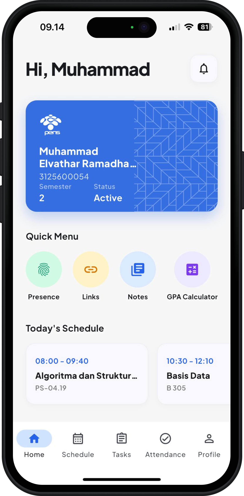
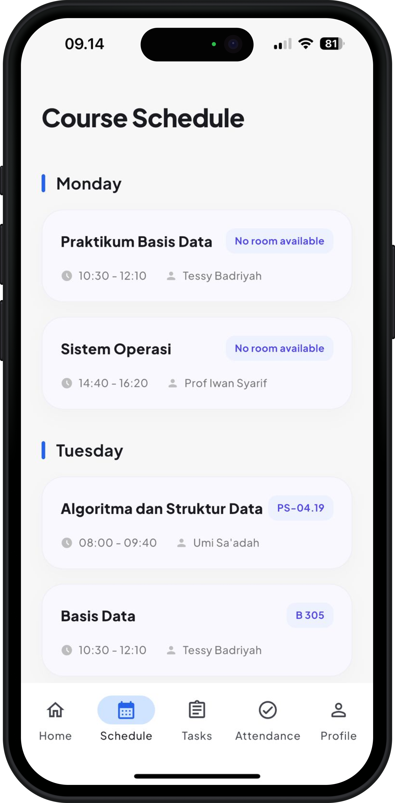
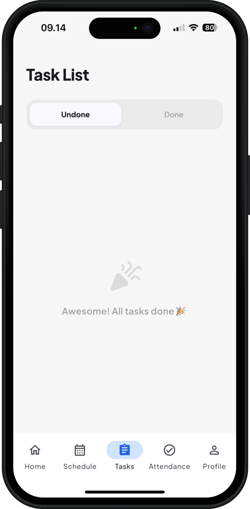
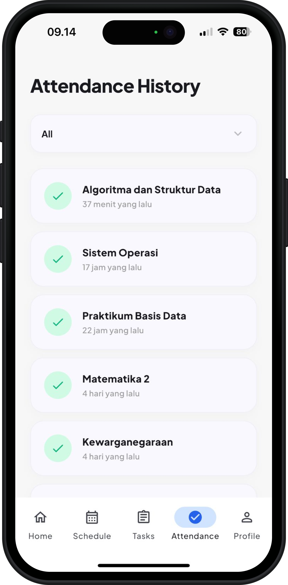
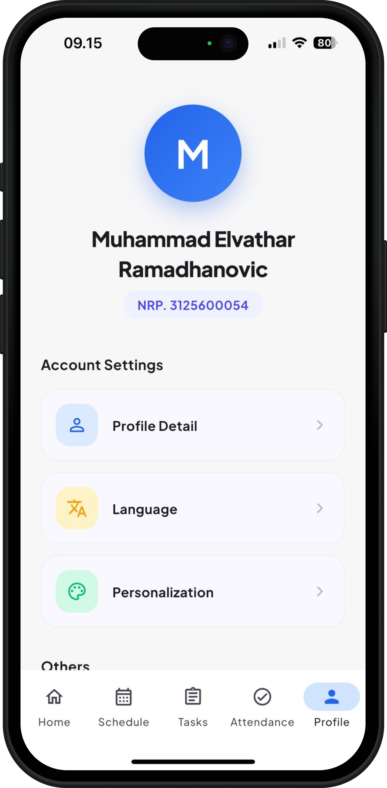

  

  ### The Ultimate Personal Hub & Campus Survival Kit
  
  
  
  

---

## 📱 Screenshots

  
  &nbsp;&nbsp;&nbsp;
  
  &nbsp;&nbsp;&nbsp;
  
  &nbsp;&nbsp;&nbsp;
  
  &nbsp;&nbsp;&nbsp;
  
  &nbsp;&nbsp;&nbsp;

---

## ✨ Key Features

Nexa is designed strictly as a personal hub and utility toolkit to survive daily campus life, featuring a modern SaaS-grade UI/UX.

* 🚀 **Quick Portal Launchpad:** One-tap bypass to essential campus websites (ETHOL, MIS, Drive Kelas) directly from the app.
* 📓 **Local Notes Vault:** A secure, offline-first note-taking feature to store your daily tasks and ideas.
* 🎨 **SaaS-Grade UI/UX:** Built with fluid bouncy animations, custom color palettes, and beautifully crafted typography using the Plus Jakarta Sans font.
* 🌙 **Dark Mode Ready:** Seamless automatic transition to dark mode to save your eyes during those late-night coding sessions.

## 🛠️ Tech Stack & Architecture

* **Framework:** Flutter 3.x
* **Database:** `sqflite` (Offline Local Storage)
* **Routing:** `url_launcher` (External Browser Routing)
* **CI/CD:** Automated APK & IPA builds using GitHub Actions.
* **Network:** ATS & Cleartext Traffic bypassed for legacy HTTP APIs.

## 📥 Getting Started / Installation

You can download the compiled version of this app directly from the [Releases Tab](https://github.com/ahmadsyahani/nexa/releases).

### For Android:
1. Download the `Nexa-v1.x.x.apk` file.
2. Open the file and grant **"Install from Unknown Sources"** permission if prompted.
3. Install and launch the app.

### For iOS:
*Note: The provided `.ipa` file is unsigned. You must use a sideloading tool.*
1. Download the `Nexa-v1.x.x.ipa` file.
2. Inject the app into your device using [AltStore](https://altstore.io/) or [Sideloadly](https://sideloadly.io/).
3. Trust the developer profile in your iOS Settings.
